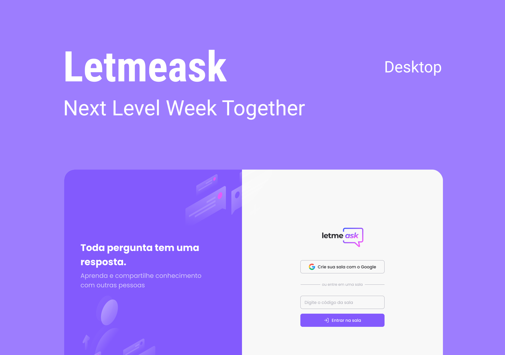

<p align="center">
  
</p>

<p align="center">
  
  
</p>

<h1 align="center">
  
</h1>

<br>

## ⚙️ Technologies

This project was developed using the following technologies:

- [React](https://reactjs.org)
- [Firebase](https://firebase.google.com)
- [TypeScript](https://typescriptlang.org)

## 🚀 How to run

First of all, you should clone this repository.

```bash
$ git clone https://github.com/hurick/letmeask.git
$ cd letmeask
```

To initialize, just follow the steps:
```bash
# Installing dependencies
$ yarn

# Starting project
$ yarn start
```
The app will be avaiable on your browser at http://localhost:3000.

Just remembering that it'll be necessary to have a [Firebase](https://firebase.google.com) account and a new project to use the Realtime Database service.

## 💻 Project

letmeask is perfect for content creators to create Q&A rooms for your public, using a organized and democratic solution.

## 🔖 Layout

You can see the project layout in the following link:

- [Web Layout](https://figma.com/community/file/1009824839797878169/Letmeask) 

You must have a [Figma](http://figma.com/) account.

## 📝 License

This project is under MIT license. See [LICENSE](LICENSE.md) file for more details.

---

Made with ❤️ and 🍵 by Hurick Krügner 👋🏻
